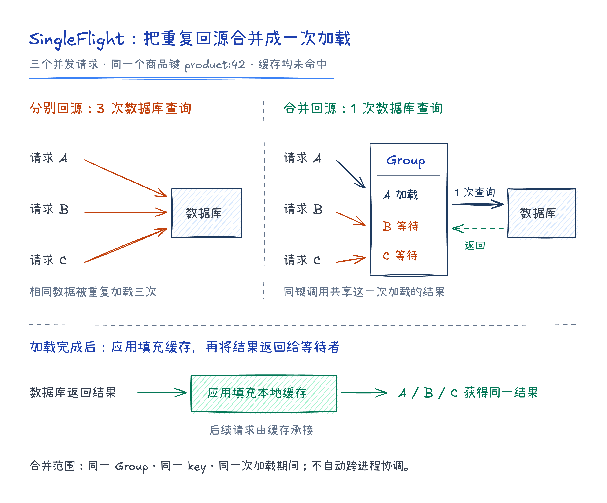
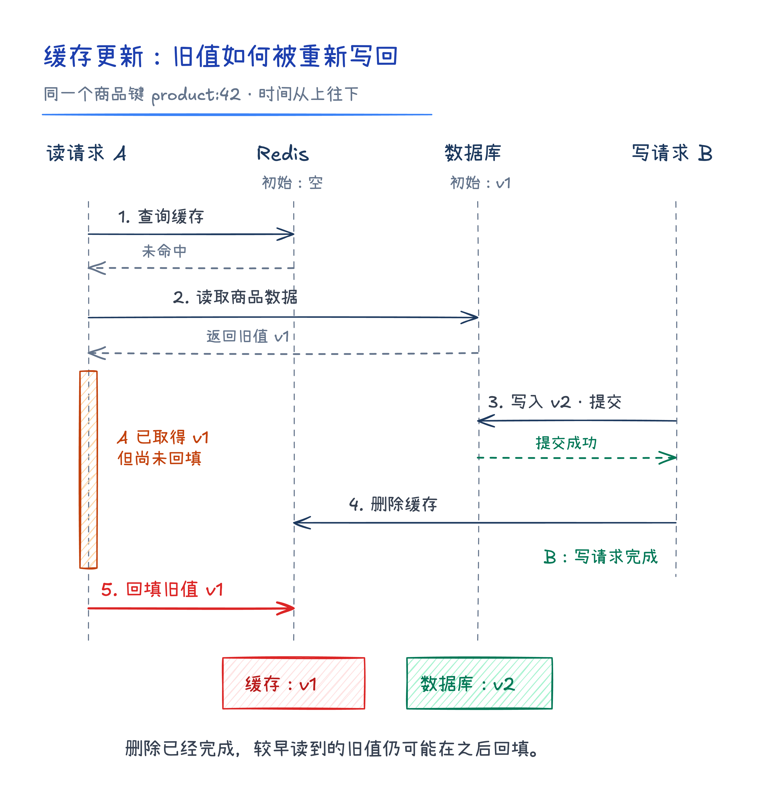
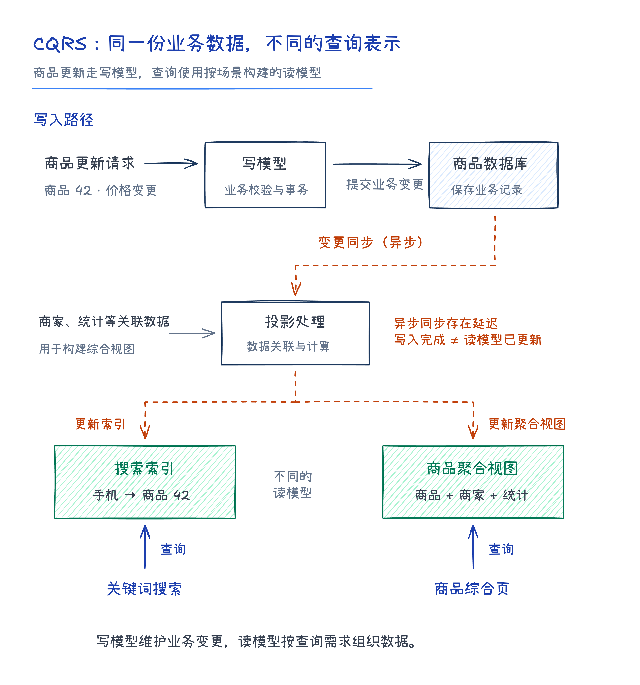
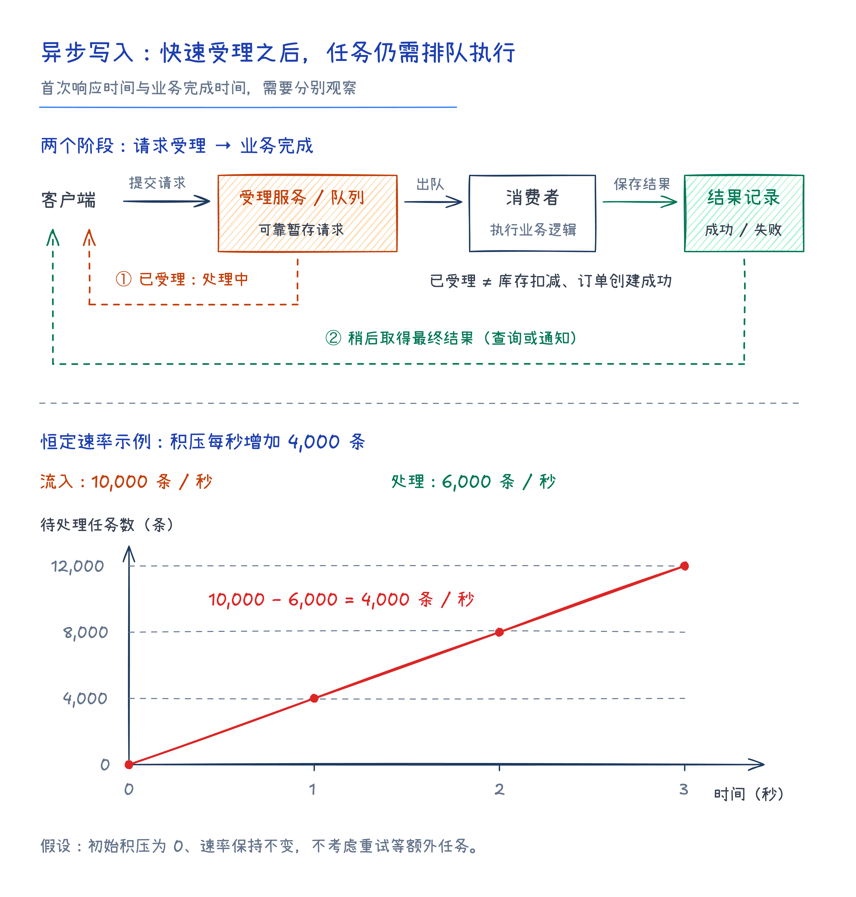

# 高并发架构：读写分工与一致性取舍

电商系统中，商品浏览和订单创建是两类典型的请求。商品成为爆款后，详情页的访问量可能快速上涨，通过增加读库、引入缓存，可以分担查询压力。但当下单请求也大量增加时，库存更新和订单写入又会成为新的瓶颈，需要进一步考虑数据分片、异步处理或写入聚合。

《亿级流量系统架构设计与实战》第二章围绕这两类负载，介绍了常见的高并发架构方案。读请求的优化主要依靠分流和减少重复查询，写请求的优化则更关注资源竞争、并行处理与执行效率。理解这些方案时，除了关注性能收益，还需要考虑数据一致性、故障恢复和后续扩容。

## 1. 高并发系统的衡量指标

高并发系统需要同时满足高性能、高可用性和可扩展性的要求。性能体现为一定负载下的吞吐量和响应时间；可用性反映系统持续提供正常服务的能力；可扩展性则衡量增加资源后，系统处理能力能够提升多少。

QPS 需要结合请求类型、响应时间和错误率一起观察。例如，商品详情接口的大部分请求都命中缓存，平均耗时可能很低，但少量未命中缓存的请求仍然需要等待慢查询。此时只看平均响应时间，就容易忽略这部分用户的体验。

分位响应时间可以补充这一信息。P99 表示在统计窗口内，约 99% 的请求耗时不超过该值。平均值反映整体情况，P99 用于观察较慢的一部分请求；如果耗时统计只包含成功请求，还应同时检查超时和失败情况。

扩容效果也需要在相同负载类型和延迟要求下比较。节点数量翻倍，而吞吐量只增长少量，往往说明系统仍受某个共享资源限制，例如数据库实例、热点键或串行执行的逻辑。商品浏览、库存扣减和后台报表的响应要求不同，性能目标应分别确定，再据此判断瓶颈和优化方向。

## 2. 数据库读写分离与复制延迟

在读多写少的业务中，可以让主库承接数据更新，让多个只读副本分担查询。读写路由既可以放在数据库代理中，也可以由应用内的数据访问层完成。新增只读副本能够增加读侧资源，并减少主库承担的查询负载。

读写分离依赖主从复制，而复制需要时间。例如，商家修改商品价格后立即刷新页面，主库已经保存了新价格，只读副本却可能还没有应用这次变更，因此页面仍然显示旧值。

不同业务对这类延迟的容忍程度不同。修改后的确认页面通常需要读取最新结果，可以将相关查询路由到主库；普通商品浏览允许短暂延迟时，则可以继续读取副本。会话分离是在此基础上进一步缩小范围：某个会话完成写入后，在一段时间内让它读取主库，以满足写后读的需求。

会话读主的时间窗口需要参考实际复制延迟。如果副本发生异常积压，固定时间窗口仍可能过早结束。采用等待副本确认的方案时，也应明确确认条件：日志已经接收，与变更已经应用并可供查询，是不同的状态。一致性要求最终需要落实到具体请求的路由和等待条件上。

## 3. 本地缓存与请求合并

即使查询已经分散到多个副本，每次读取仍然有网络通信和数据库执行成本。对于短时间内反复访问的商品基础信息，可以将结果保存在应用进程的内存中，后续请求直接读取本地缓存。

缓存容量有限，需要选择合适的淘汰策略。FIFO 按进入缓存的先后顺序淘汰；LFU 优先淘汰访问频率较低的数据，但历史热点可能长期占据空间；LRU 优先淘汰最久未被访问的数据，能够适应近期访问变化，但批量扫描也可能挤走原有热点。不同策略适合的访问分布并不相同。

W-TinyLFU 在短期访问窗口、分段 LRU 和访问频率估计之间做了结合。新数据先进入窗口，获得短暂的缓存机会；进入主要缓存区域时，再与已有候选比较访问频率。频率记录通过衰减减少历史访问的影响。与单纯决定淘汰哪个条目相比，这种方式还会判断新数据是否值得保留。

热点数据失效时，需要处理的另一个问题是并发回源。假设某份商品信息刚刚过期，多个请求同时发现缓存未命中，便分别访问数据库。虽然它们需要的是同一份数据，却重复执行了相同查询，这类场景通常称为缓存击穿。

SingleFlight 按键合并正在执行的调用。第一个请求负责加载，同一键的其他请求在这次加载结束前等待，并共享返回结果。加载成功后，应用将结果写入缓存，后续请求即可恢复为缓存读取。在合并后的加载逻辑中再次检查缓存，还可以避免竞争期间其他请求已经填充缓存而产生的重复查询。

*图 1：同键请求在一次加载期间共享结果，后续请求由缓存承接。*

SingleFlight 的作用范围是同一个协调对象内、执行时间重叠的同键调用。它不长期保存结果，调用结束后的新请求仍可能重新触发加载；不同服务进程各自持有的协调对象，也不会自动合并彼此的请求。因此，请求合并通常需要与缓存配合使用。

## 4. 分布式缓存及典型失效场景

本地缓存的访问开销很低，但不同进程各自保存一份数据，更新时需要处理多个副本之间的差异，进程重启后也需要重新预热。使用 Redis 等共享缓存，可以让多个服务实例复用结果，同时将缓存容量与应用进程内存分开管理。

常见的读取方式是先查缓存，未命中时查询数据库，再将结果写入缓存。这种按需加载方式通常称为 Cache Aside。它减少了重复查询，但缓存失效时，请求仍会回到数据库。击穿、穿透和雪崩的区别，可以从回源原因和影响范围理解。

| 情况 | 回源原因 | 处理方式 |
| --- | --- | --- |
| 缓存击穿 | 热点键失效，同一数据的多个请求同时回源 | 合并同键加载，控制重建期间的回源压力 |
| 缓存穿透 | 请求的数据在数据库中也不存在，反复查询仍无法填充正常缓存 | 缓存空结果，使用布隆过滤器排除不可能存在的数据 |
| 缓存雪崩 | 大量键同时过期，或缓存服务整体不可用 | 分散过期时间，提高缓存可用性，并控制回源流量 |

缓存穿透既可能针对同一个不存在的键，也可能针对大量不同的键。缓存空结果能够拦截重复查询，但需要设置合适的有效期，避免数据新建后仍然返回不存在。布隆过滤器适合进一步减少无效查询：它的否定结果可以排除未加入集合的数据，肯定结果则仍可能误判。过滤器还需要及时同步新增数据，否则合法请求也可能被拦截。

缓存雪崩需要按诱因处理。随机分散过期时间，可以避免大量数据集中失效；缓存服务宕机则需要依靠可用性设计，以及故障期间的回源控制。将所有请求直接转发到数据库，可能只是把缓存故障扩大成数据库故障。

过期策略还会影响数据新鲜度。如果应用在每次命中时都延长旧值的有效期，热点数据可能长期不再回源。因而，缓存过期时间应结合更新方式一起设计，不能简单地把十秒 TTL 理解为数据一定会在十秒内恢复一致。

## 5. 缓存更新与数据一致性

数据库与缓存是两个独立系统，更新时需要处理操作顺序、并发交错和部分失败。常见方案可以分为直接更新缓存和删除缓存两类，再分别考虑它们与数据库更新的先后关系。

直接更新缓存时，两个并发请求可能在数据库和缓存中以不同顺序完成，最终留下不同的值。先删除缓存再更新数据库，也存在竞态：另一个读请求可能在数据库更新前读到旧值，并将它重新写入缓存。

比较之下，先更新数据库、再删除缓存是一种常见的基础策略。写请求提交后使缓存失效，下一次读取再按需加载，能够避免并发写请求分别维护缓存值时产生的一部分问题。但这种操作顺序仍然存在旧数据回填的可能。

假设缓存为空、数据库保存着旧值 v1，读请求 A 和写请求 B 按以下顺序执行：

*图 2：写请求删除缓存后，较早开始的读请求仍可能回填旧值。*

最终数据库中的值是 v2，缓存中的值却是 v1。写请求虽然完成了更新和删除，较早发起的读取仍然在之后写回了旧结果。因此，先写库再删缓存能够降低不一致的风险，但不能单独提供严格一致性保证。

另一类问题是数据库更新成功、缓存删除失败。允许短期陈旧的业务，可以结合过期和重试处理；一致性要求较高的业务，则需要更可靠的变更传递与失效机制。使用消息队列时，也需要保证数据库变更能够可靠地进入消息链路，并处理消费失败、重复消息和乱序。

缓存策略应由业务对数据新鲜度的要求决定。商品描述可以容忍的延迟，与库存校验要求的准确程度并不相同。对关键读取，可以选择直接访问权威数据源，或采用具备相应一致性保证的读写机制。

## 6. CQRS 与读写模型分离

CQRS，即命令查询职责分离，将修改数据的操作与查询数据的操作分开设计。写模型负责业务变更，读模型负责高效查询，两者可以采用不同的数据结构和存储方式。

以商品系统为例，关系型数据库保存商品记录；关键词检索使用搜索索引；包含商品、商家和统计信息的页面，则可以读取提前计算好的聚合视图。这些读模型服务于不同的查询需求，通过变更消息或定时任务保持更新。

*图 3：写模型维护业务数据，读模型按照查询需求组织数据，并通过变更同步更新。*

数据库读写分离与 CQRS 的侧重点不同。前者主要改变请求的路由位置，副本通常保留与主库相同的数据结构；后者进一步分离读写模型，使查询可以使用专门的数据表示。仅仅增加 Redis 缓存，并不意味着应用已经具备完整的命令与查询模型。

搜索索引和宽表能够把重复查询计算提前完成，减少在线请求的处理成本，但也增加了派生数据的维护工作。写入完成后，读模型可能尚未更新；同步链路中断后，需要补齐变更或重建数据。因此，设计读模型时应同时确定更新方式、允许延迟和恢复流程。

## 7. 数据分片与扩容

当写入成为瓶颈时，可以通过分片将数据或请求分配给多个处理单元，让原本竞争同一组资源的操作并行执行。数据库分库分表是其中一种常见形式，按照拆分维度可分为垂直拆分和水平拆分。

垂直拆分按业务或字段划分。例如，将商品与订单放入不同数据库，可以隔离不同业务的负载；将商品的常用字段与较大的详情字段拆开，可以减少高频查询需要处理的数据。水平拆分则按记录分配数据，让不同用户或订单落到不同的库表中。

分表与分库解决的问题也不完全相同。同一数据库实例内的分表可以减小单表规模，但多个表仍然共享 CPU、内存和 I/O。要缓解实例资源瓶颈，需要将负载分散到不同实例。是否拆分，应结合查询方式、索引、数据宽度和资源使用情况判断，而非只依据表中的记录数。

分片键的选择会直接影响查询成本。按用户划分订单，查询某个用户的订单容易定位分片；查询商家跨用户的订单统计，则可能需要访问多个分片。关联、聚合和事务也可能跨越数据库边界，因此分片设计必须同时考虑主要读写路径。

常见的路由方式包括范围分区、哈希分区和一致性哈希。范围分区便于按时间或编号查找，但新增写入容易集中在最新范围；哈希分区有助于分散不同键，简单取模却会在分片数量变化时改变大量映射；一致性哈希可以减少扩缩容时受影响的映射范围，虚拟节点则用于改善分布。

数据分布均匀，不代表请求压力均匀。爆款商品即使经过哈希，也仍然落在一个确定的分片上。虚拟节点能够改善多个键的分布，但无法自动拆开同一键上的更新竞争。库存分段、Kafka 分区等方案体现了更细粒度的工作分担，其中库存分段还需要处理扣减与汇总的正确性。

扩容时还需要迁移数据并切换路由。书中介绍的“从库升级法”先复制数据，在切换阶段临时停止相关写入，确认同步完成后拆分负责范围，将从库提升为独立主库，再更新路由、恢复写入并清理冗余数据。该方案包含停写窗口，实施时需要评估业务影响，并安排数据校验、路由切换失败的恢复措施和新的副本配置。

## 8. 异步写入与批量聚合

异步写将请求受理与实际执行分成两个阶段：先暂存请求并返回受理状态，再由后台执行，用户随后查询结果或接收通知。队列可以承接短期突发流量，让消费者按照下游能够承受的速度处理任务。

抢购接口返回“处理中”，表示请求已经进入处理流程，库存扣减和订单创建仍可能尚未完成。系统需要分别记录受理、执行和完成状态，并提供结果查询。请求暂存的可靠性也需要与受理承诺一致，否则服务重启后，已经受理的任务可能无法继续处理。

队列的缓冲能力受到消费速度和容量限制。假设持续流入速度是每秒 1 万条，消费能力是每秒 6 千条，则每秒会新增约 4 千条待处理任务。异步接口仍然可以快速返回，但业务完成时间会不断延长。因此，监控指标除了接口耗时，还应包括积压量、最老任务的等待时间和最终完成时间。

*图 4：队列可以缓冲短期峰值；持续输入超过处理能力时，等待任务仍会增长。*

写聚合则通过将多次写入收集成批，减少重复通信或执行开销。Kafka Producer 的批量发送和热点更新优化，是书中给出的两个例子。批量传输保留每个操作，只是将它们放在同一批次中发送；业务合并则会改变执行方式，例如把允许累加的多次计数增量合成一次更新。

批次大小需要在吞吐量、等待时间和失败处理成本之间权衡。较大的批次可以分摊固定开销，但也可能增加等待凑批的时间、重试成本和资源占用。对于有顺序要求、独立返回值或条件判断的写入，应先确认业务是否允许合并。

## 9. 架构方案的选择

读写分离分担数据库查询，缓存减少重复读取，CQRS 为特定查询建立专用模型；分片增加可并行使用的资源，异步写缓冲突发请求，写聚合降低重复执行开销。这些方案可以组合使用，但各自解决的瓶颈不同。

选择方案时，应先定位主要压力和共享资源，再结合业务能够接受的一致性、响应时间与运维成本进行判断。引入读副本要处理复制延迟，引入缓存要设计失效与更新，分片要考虑热点和迁移，异步化则要管理积压和最终结果。将这些问题与性能收益一起评估，架构设计才具备实施和持续演进的基础。

## 参考资料

李琛轩：《亿级流量系统架构设计与实战》，电子工业出版社，2024 年，第 2 章“通用的高并发架构设计”。
