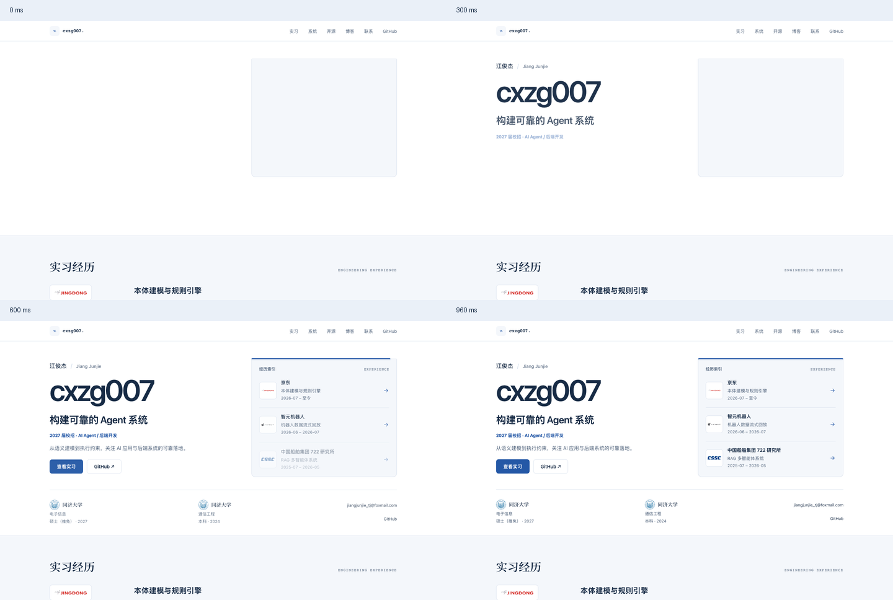

# 首屏入场动画

日期：2026-09-30。基线 `07499a4`，隔离分支 `design/hero-entrance`。

## 展示与实现

技术 ID 在遮罩内上移，姓名和简介分组出现，经历按京东、智元、中国船舶的顺序展开，顶端蓝线从左侧延伸。整段约 960ms，只在同一标签页会话首次桌面访问播放；点击、键盘、聚焦或滚动立即进入完整阅读状态。保留此前的贡献整合、项目图标、字体与事实内容。

采用 CSS keyframes 与一小段静态内联脚本，不新增依赖。服务端内容默认可见，脚本在首屏子元素解析前决定是否启用动效；不通过挂载后隐藏内容实现入场。脚本只改变所属 section 的状态属性，对应局部 hydration 豁免。动画自然结束后移除监听和计时器，并设 1600ms 兜底；CSS 使用 backwards 填充，即使清理异常也回到可见样式。

窄屏、减少动态效果、隐藏标签页、锚点定位、历史返回、站内来源与存储受限均静态显示。博客客户端返回和刷新不重播；Next 客户端 JS 无法加载时原生动画与链接依旧工作。当前手机仅保留静态页面。

## Skill 与动效审查

已通过 skill-installer 安装并应用 `emilkowalski/skills@d16ebe60d09a5ba2afcb7054ede9d0a10c9f6128` 的 `animate`、`review-animations`。阅读其 `RECIPES.md`、`STANDARDS.md`，框架细节以本地 Next.js 16.3.1 文档为准。

| 检查项 | 最终处理 | 判断 |
| --- | --- | --- |
| 播放频率 | 会话首次访问，站内返回与刷新静态 | 通过，低频展示适用 |
| 曲线与错峰 | `cubic-bezier(0.23,1,0.32,1)`；经历间隔 80ms | 通过 |
| 时长 | 单项 400–600ms，总编排 960ms | 作品集展示允许较长；输入即时结束 |
| 性能 | 标题/文字 transform + opacity，装饰线 scaleX | 通过；无布局属性动画 |
| 遮罩 | 标题父层静态 clip-path，结束后移除 | 通过；不持续动画化遮罩 |
| 打断与清理 | 输入、页面隐藏、媒体变化立即结束，AbortController 清理 | 通过 |
| 可访问性 | reduced-motion 静态可读，保留键盘与焦点 | 通过；按项目约定略去纯装饰性入场 |

独立只读审查未发现功能阻塞项，指出装饰线可由 clip-path 改成 transform；已改为左侧起点的 scaleX。该建议为规范收敛，未观察到实际掉帧。最终无待处理审查项。

## 验证

- Vitest：24 个文件、231 项通过，含 19 项新脚本生命周期测试；脚本测试经历缺失模块的预期失败后实现通过。
- ESLint、TypeScript、内容校验通过；Next.js 生产构建成功。
- Playwright 全量：281 项通过、34 项按项目设备条件跳过，覆盖 Chrome 桌面、平板宽度与手机宽度。
- 新增浏览器用例验证 300/600ms 中间状态、900–1000ms 时长范围、前后尺寸、首次播放、自然结束、刷新与博客返回、键盘与指针打断、偏好切换、无 JS、存储受限和客户端脚本被阻断。
- 既有 15 项视觉截图全部通过，无需更新基线。Axe 检查等待自然入场结束后测量完整阅读状态，避免把淡入中间帧作为最终文字颜色。
- 指针用例最初将按钮原有 background-color 悬停过渡计作未结束入场，确认状态已 complete 且链接已导航后，断言收窄为本次 CSSAnimation；保留悬停功能。
- 主 checkout 既有 diff SHA256 保持 `afd747c811249dc85d7bd15a19b0f092f4b404a26a0da7b96f28f0a22b5317a7`。

人工查看四个时间点的截图，身份先出现、京东优先进入，内容没有裁切和最终位移。

## 正式站部署

- 代码提交：`fb4073a`，已推送 `origin/design/hero-entrance`。
- Vercel Production：`dpl_3scNaTHLHzZGhaWrsawiSzxNZvpM`，状态 READY。
- 正式站：https://jiangjunjie-personal-portal.vercel.app/
- 部署地址：https://jiangjunjie-personal-portal-qaifkvv7t-junjie1467-6343s-projects.vercel.app
- 北京时间 2026-09-30 10:49 完成正式域名浏览器核验：HTTP 200；12 项动画正常开始、结束，首项至末项约 956ms，最终 opacity=1、transform=none。
- 刷新、博客返回不重播；独立 reduced-motion 会话静态显示；无 pageerror 或 console error。
- 开源区 19 个 PR 各出现一次，Semantica 图标正常加载；canonical 指向正式域名，无横向溢出。
- 原始核验结果见 [production-checks.json](assets/2026-09-30-hero-entrance/production-checks.json)。

部署记录补充提交仅修改文档与核验产物，无需重新部署页面代码。

## 同日节奏调整

用户希望入场放慢至约两秒。全部入场 duration 和 delay 等比例乘二，总时长从 960ms 调整至 1920ms；经历错峰从 80ms 变为 160ms，沿用原缓动与顺序。兜底从 1600ms 延长至 2800ms，避免在正常播放结束前截断。点击、键盘、滚动即时结束以及首次访问和静态降级行为保持。

更新既有时长、中间帧和兜底断言。19 项脚本测试、ESLint、生产构建通过；相关浏览器回归 92 项通过、25 项按设备条件跳过，包含入场时序、自然结束、即时打断、无 JS、存储受限、Axe 与既有视觉截图。

代码提交 `27e45b7` 已推送。正式部署 `dpl_GMMQcQnz8iN63w2sWQe7MK77T1ED` 为 READY，正式域名已切换至 `jiangjunjie-personal-portal-q9eoizrf6-junjie1467-6343s-projects.vercel.app`。线上实测 12 项动画均完整开始和结束，总时长约 1904ms，刷新静态，无页面错误。
